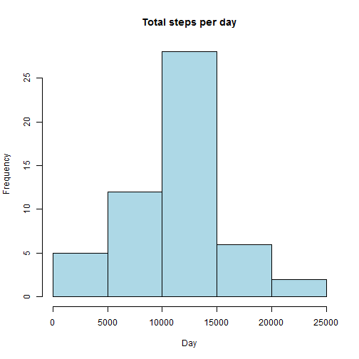
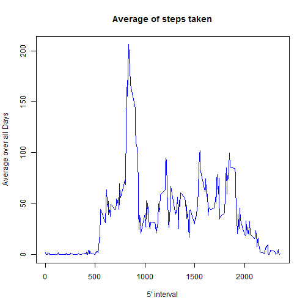
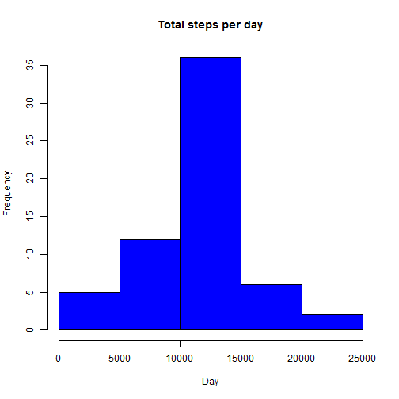

## Load the data and pre-process

```r
## load the lattice library
    library(lattice)
## read the data into "activity" 
    activity <- read.csv("activity.csv", colClasses = c("numeric", "character", 
    "numeric"))
## convert the activity date column to date format
    activity$date <- as.Date(activity$date, "%Y-%m-%d")
```
## Determine the mean and median total number of steps taken per day.

### Histogram of total steps per day.

```r
## aggregate the data stor in a variable "TotalSteps"
    TotalSteps <- aggregate(steps ~ date, data = activity, sum, na.rm = TRUE)
## Create the histogram
    hist(TotalSteps$steps, main = "Total steps per day", xlab = "Day", col = "lightblue")
```

 

### The mean total number of steps taken per day:

```r
## Use the mean function
    mean(TotalSteps$steps)
```

```
## [1] 10766.19
```

### The median total number of steps taken per day:

```r
## Use the median function
    median(TotalSteps$steps)
```

```
## [1] 10765
```

## Determine the average daily activity pattern. 

### Time series plot of 5-minute interval (x-axis) and the average number of steps taken, averaged across all days (y-axis)

```r
## get the mean    
    TimeSeries <- tapply(activity$steps, activity$interval, mean, na.rm = TRUE)
## Generate the plot    
    plot(row.names(TimeSeries), TimeSeries, type = "l", xlab = "5' interval", 
    ylab = "Average over all Days", main = "Average of steps taken", 
    col = "blue")
```

 

### The 5-minute interval, on average across all the days in the dataset, with the maximum number of steps:

```r
    MaxInterval <- which.max(TimeSeries)
    names(MaxInterval)
```

```
## [1] "835"
```

## Dealing with missing values (NA) in the data set:

### The total number of missing (NA) values in the data set:

```r
## sum the missing values   
    MissingValues <- sum(is.na(activity))
    MissingValues
```

```
## [1] 2304
```

### Filling in the missing values (NA) with the mean for the 5' interval:

```r
## loop throug each row and replace NA with mean for that 5' interval    
    AverageSteps <- aggregate(steps ~ interval, data = activity, FUN = mean)
    ReplaceMissing <- numeric()
    for (i in 1:nrow(activity)) {
        obs <- activity[i, ]
        if (is.na(obs$steps)) {
            steps <- subset(AverageSteps, interval == obs$interval)$steps
        } else {
            steps <- obs$steps
        }
        ReplaceMissing <- c(ReplaceMissing, steps)
    }       
```

### An Equivalent data set with missing values filled in:

```r
    EquivalentActivity <- activity
    EquivalentActivity$steps <- ReplaceMissing
```

## The mean and median of the total number steps taken each day with NA replaced.

### Histogram of the total steps per day:

```r
    EquivalentTotalSteps <- aggregate(steps ~ date, data = EquivalentActivity, sum, na.rm = TRUE)
    hist(EquivalentTotalSteps$steps, main = "Total steps per day", xlab = "Day", col = "blue")
```

 

### The mean number of total steps taken per day with NA removed:

```r
    mean(EquivalentTotalSteps$steps)
```

```
## [1] 10766.19
```

### The median number of total steps taken per day with NA removed:

```r
    median(EquivalentTotalSteps$steps)
```

```
## [1] 10766.19
```

**Replacing the missing values changes the median but the mean remains the same.**

## Differences in weekday vs. weekend activity patterns:

### Create a new factor variable in the dataset with two levels – “weekday” and “weekend” indicating whether a given date is a weekday or weekend day


```r
    day <- weekdays(activity$date)
level <- vector()
for (i in 1:nrow(activity)) {
    if (day[i] == "Saturday") {
        level[i] <- "Weekend"
    } else if (day[i] == "Sunday") {
        level[i] <- "Weekend"
    } else {
        level[i] <- "Weekday"
    }
}
activity$level <- level
activity$level <- factor(activity$level)

StepsPerDay <- aggregate(steps ~ interval + level, data = activity, mean)
names(StepsPerDay) <- c("interval", "level", "steps")
```

### A panel plot containing a time series plot (i.e. type = "l") of the 5-minute interval (x-axis) and the average number of steps taken, averaged across all weekday days or weekend days (y-axis). 


```r
xyplot(steps ~ interval | level, StepsPerDay, type = "l", layout = c(1, 2), 
    xlab = "Interval", ylab = "Number of steps")
```

 
